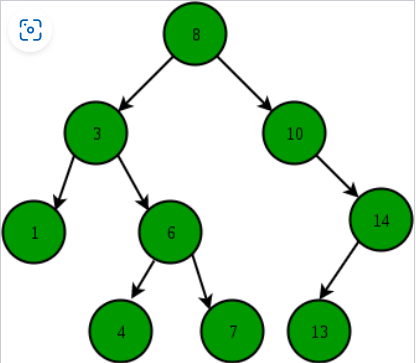

# binary-search-tree

## Introduction

A binary search tree is a binary tree that contains nodes and has the following properties:

1-The left branch of a node contains nodes that have keys with a value less than the key value of this node.<br>
2-The right branch of a node contains nodes that have keys with a value greater than the key value of this node.<br>
3-The left and right branch must also be binary search trees, and no nodes can be the same.<br>
<strong>Remark</strong> : These properties impose a special order of the elements in the binary data tree that depends on the value of the key, and as a result, the execution of searches and finds the minimum or maximum value is faster.<br>


## Insert a key into the binary search tree

The new element is always inserted into the leaf node. We start searching for a specific key starting from the root and ending with the leaf node. If we find a leaf node, we include the new node as its child node.

```
         100                               100
        /   \        Insert 40            /    \
      20     500    --------->          20     500
     /  \                              /  \
    10   30                           10   30
                                            \
                                            40
```

With Java :

```
public class BinarySearchTree {
    // 1-A class that contains the left and right nodes of the current node and the key value
    class Node {
        int key;
        Node left, right;

        public Node(int item) {
            key = item;
            left = right = null;
        }
    }

    // 2-Binary search tree root
    Node root;

    // 3-Contructor
    BinarySearchTree() {
        root = null;
    }

    // 4-This method calls the function insertRec
    void insert(int key) {
        root = insertRec(root, key);
    }

    /* 5-A recursive function to insert a new key into the binary search tree */
    Node insertRec(Node root, int key) {

        /* 6-If the tree is empty, the function returns a new node */
        if (root == null) {
            root = new Node(key);
            return root;
        }

        /* 7-Otherwise the function will call itself back on the tree branches */
        if (key < root.key)
            root.left = insertRec(root.left, key);
        else if (key > root.key)
            root.right = insertRec(root.right, key);

        /* 8-The function returns the pointer of the node */
        return root;
    }

    // 9-This method calls the function inorderRec
    void inorder() {
        inorderRec(root);
    }

    // 10-A helper function to perform mean navigation in a binary search tree
    void inorderRec(Node root) {
        if (root != null) {
            inorderRec(root.left);
            System.out.println(root.key);
            inorderRec(root.right);
        }
    }

    // Test
    public static void main(String[] args) {
        BinarySearchTree tree = new BinarySearchTree();

		/* Let's create the following binary search tree
		    50
		 /	   \
		30	   70
		/ \   / \
	   20 40 60 80
	   */
        tree.insert(50);
        tree.insert(30);
        tree.insert(20);
        tree.insert(40);
        tree.insert(70);
        tree.insert(60);
        tree.insert(80);

        // Printing
        tree.inorder();
    }
}
```

<strong>time complexity</strong><br>
The worst possible search and insert time complexity is O(h) and h is the height of the binary search tree. In the worst case scenario, we will have to navigate through the tree elements from the root to the last leaf node. Sometimes the height of the skewed data tree can be n and then the insert and lookup times complexity is O(n).

## Search for a key

The process of searching for a specific key in the binary search tree begins by comparing this key with the root. In the left branch of the node.

```
public class BinarySearchTree {
    // 1-A class that contains the left and right nodes of the current node and the key value
    class Node {
        int key;
        Node left, right;

        public Node(int item) {
            key = item;
            left = right = null;
        }
    }

    // 2-Binary search tree root
    static Node root;

    // 3-Contructor
    BinarySearchTree() {
        root = null;
    }

    // 4-This method calls the function insertRec
    void insert(int key) {
        root = insertRec(root, key);
    }

    /* 5-A recursive function to insert a new key into the binary search tree */
    Node insertRec(Node root, int key) {

        /* 6-If the tree is empty, the function returns a new node */
        if (root == null) {
            root = new Node(key);
            return root;
        }

        /* 7-Otherwise the function will call itself back on the tree branches */
        if (key < root.key)
            root.left = insertRec(root.left, key);
        else if (key > root.key)
            root.right = insertRec(root.right, key);

        /* 8-The function returns the pointer of the node */
        return root;
    }

    // 9-This method calls the function inorderRec
    void inorder() {
        inorderRec(root);
    }

    // 10-A helper function to perform mean navigation in a binary search tree
    void inorderRec(Node root) {
        if (root != null) {
            inorderRec(root.left);
            System.out.println(root.key);
            inorderRec(root.right);
        }
    }

    public Node search(Node root, int key)
    {
        // Basic case: the key is empty or the key is in the root
        if (root==null || root.key==key)
            return root;

        // The key must be greater than the root key
        if (root.key > key)
            return search(root.left, key);

        // The key must be smaller than the root key
        return search(root.right, key);
    }

    // Test
    public static void main(String[] args) {
        BinarySearchTree tree = new BinarySearchTree();

		/* Let's create the following binary search tree
		    50
		 /	   \
		30	   70
		/ \   / \
	   20 40 60 80
	   */
        tree.insert(50);
        tree.insert(30);
        tree.insert(20);
        tree.insert(40);
        tree.insert(70);
        tree.insert(60);
        tree.insert(80);

        // Printing
        tree.inorder();

        //search
        System.out.println(tree.search(root,55).key);
    }
}
```
